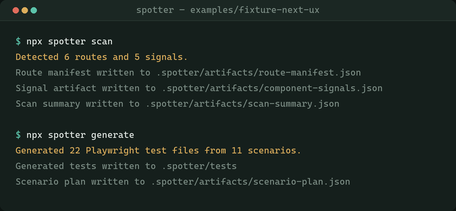
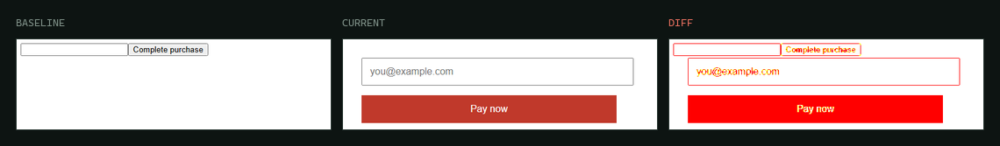

# Spotter

[](https://github.com/dacheson/spotter/actions/workflows/ci.yml)
[](https://www.npmjs.com/package/@dcacheson/spotter)
[](LICENSE)
[](https://nodejs.org)

Spotter finds the UX states a frontend actually has — loading, empty, error, permission-gated,
localised — and turns them into Playwright visual regression coverage.



## What that run produced

Those two commands ran against `examples/fixture-next-ux`, a Next.js app in this repository. With
no configuration beyond `spotter init` and no LLM involved, Spotter derived eleven scenarios from
route declarations and component ASTs alone:

| Scenario | Route | Priority | Signals |
| --- | --- | --- | --- |
| `admin-auth-gate` | `/admin` | high | admin, auth |
| `admin-role-gate` | `/admin` | high | admin, role |
| `admin-default` | `/admin` | high | admin |
| `checkout-loading-state` | `/checkout` | high | checkout, loading |
| `checkout-validation-state` | `/checkout` | high | checkout, form, validation |
| `checkout-default` | `/checkout` | high | checkout |
| `products-empty-state` | `/products` | low | products, empty |
| `products-default` | `/products` | low | products |
| `blog-slug-default` | `/blog/[slug]` | low | blog, slug |
| `pricing-default` | `/pricing` | low | pricing |
| `home-default` | `/` | low | home |

The auth gate, the role gate, the loading state, the validation state and the empty state are the
cases most likely to be missed by hand — none of them is a page you navigate to directly.

Expanded across the configured viewports and locales, those eleven scenarios become 22 specs:

```ts
// .spotter/tests/admin-admin-auth-gate-desktop-en-us.spec.ts
import { expect, test } from '@playwright/test';

test.describe('admin-auth-gate', () => {
  test.use({ viewport: { width: 1440, height: 900 } });

  test('admin-auth-gate', async ({ page }) => {
    await page.goto('/admin');
    await expect(page).toHaveScreenshot('admin-auth-gate-desktop-en-US.png', {
      animations: 'disabled',
      caret: 'hide',
      fullPage: true,
      scale: 'css'
    });
  });
});
```

## What it catches

Restyling the checkout form — full-width red button, new label, a placeholder on the input — and
running `spotter changed`:



Six of the twenty-two screenshots changed, and all six were the checkout scenarios: default,
loading and validation, across both viewports. The other sixteen were untouched, so the report
points at the three states one change actually moved rather than at the whole suite.

```
| Metric               | Value |
| Total scenarios      |    11 |
| Changed scenarios    |     6 |
| High priority diffs  |     6 |
```

## Why it exists

Applications contain far more UI states than teams test by hand, and the ones that get missed are
the ones you cannot reach by typing a URL. Spotter derives them from the repository instead of
from memory.

The analysis is deterministic by design. A visual suite is only useful if developers trust it, and
they stop reading output they cannot explain — so the repository is the source of truth, every
scenario carries its provenance, and an LLM is optional and only ever *proposes* scenarios for
review.

Longer version, including what turned out to be hard: **[Why I built Spotter](docs/why-spotter.md)**.

## Quick start

```bash
npm install -D @dcacheson/spotter @playwright/test
npx playwright install

npx spotter init        # write a starter spotter.config.json
npx spotter scan        # discover routes and UX-state signals
npx spotter generate    # turn them into Playwright specs
npx spotter baseline    # capture baseline screenshots
```

Then, after a code change:

```bash
npx spotter changed     # rerun only the impacted scenarios
npx spotter report      # render the manifest-first summary
```

## Commands

| Command | What it does |
| --- | --- |
| `init` | Write a starter config in the current repository |
| `scan` | Discover routes and component UX-state signals |
| `generate` | Turn the current scan into scenarios and Playwright specs |
| `prompt` | Write a copy-pasteable prompt for an IDE agent to suggest extra scenarios |
| `import` | Merge a reviewed JSON response from `prompt` and regenerate |
| `override` | Write a durable include/exclude correction into the config |
| `baseline` | Capture baseline screenshots for the generated specs |
| `changed` | Rerun impacted scenarios and compare against the baselines |
| `report` | Render a Markdown report from the latest run artifacts |

## How it works

1. Detect routes through per-framework adapters.
2. Walk components and extract state signals from the syntax tree — loading, error, empty, modal,
   form, auth, role.
3. Turn those into scenarios, deduplicated by user-visible state and prioritised deterministically.
4. Generate Playwright specs and capture baselines.
5. On later runs, map changed files to impacted scenarios and report what moved.

Changed files that map cleanly to a route produce *trusted* scenarios. Shared-component changes
produce a separate, bounded `Possible Additional Impact` set rather than being blended in or
triggering a full-suite rerun. See [ARCHITECTURE.md](ARCHITECTURE.md) for the layer breakdown.

## Framework support

Route discovery is strongest where routes are declared or file-based:

- Next.js app router and pages router, at the project root or under `src/`
- Remix flat-file routes
- Nuxt pages routes
- React Router route config and `<Route path=...>` declarations
- Vue Router route config

Component scanning covers TS, TSX, JS, JSX and Vue single-file components regardless of framework.

When routes cannot be inferred deterministically, `scan` and `generate` say so explicitly and
record the framework they detected. Spotter does not invent route coverage to fill the gap — an
LLM fallback exists but is opt-in.

## What it writes

Everything lands under `.spotter/` so it can be reviewed in git:

```
.spotter/tests/        generated Playwright specs
.spotter/baselines/    screenshot baselines
.spotter/artifacts/    route manifest, signals, heuristics, scenarios,
                       scenario plan, run metadata, visual-report.md
```

The scenario manifest is the primary review artifact — route identity, scenario name, why it was
included, confidence, provenance and correction hint. Generated tests are derived machinery, and
are treated as stale when they drift from it.

## Configuration

`spotter init` writes a working config; with no config at all, built-in defaults apply. The full
reference — servers, scenario overrides, LLM fallback — is in
**[docs/configuration.md](docs/configuration.md)**.

## Documentation

- [Why I built Spotter](docs/why-spotter.md) — design reasoning and trade-offs
- [docs/configuration.md](docs/configuration.md) — full config reference
- [ARCHITECTURE.md](ARCHITECTURE.md) — layer breakdown
- [CONTRIBUTING.md](CONTRIBUTING.md) — development setup
- [docs/releasing.md](docs/releasing.md) — publishing to npm

## Licence

[MIT](LICENSE)
